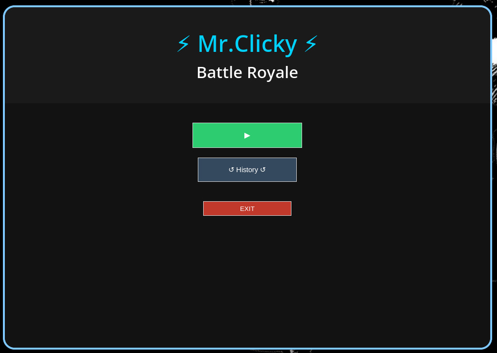
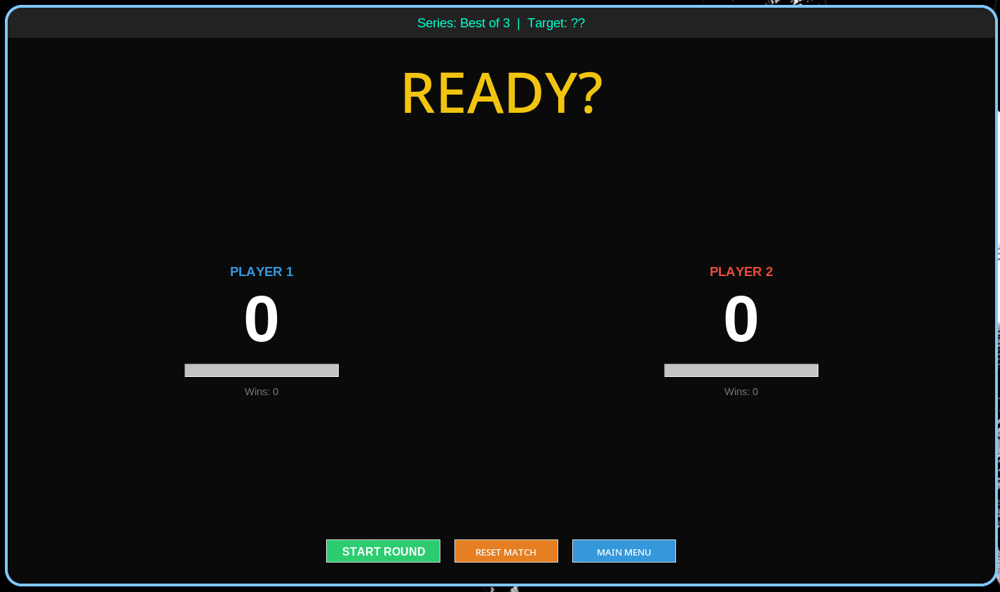
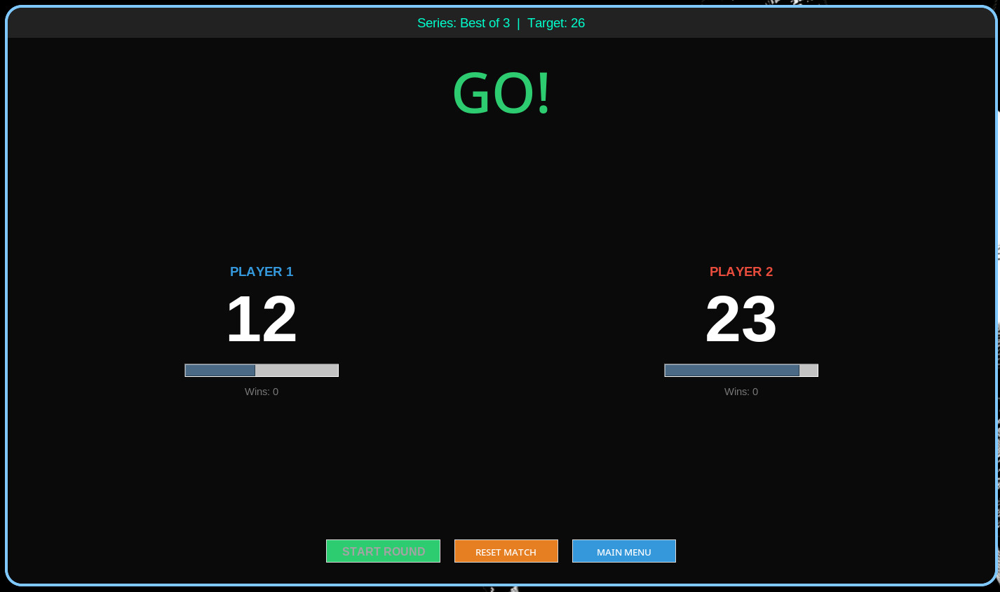
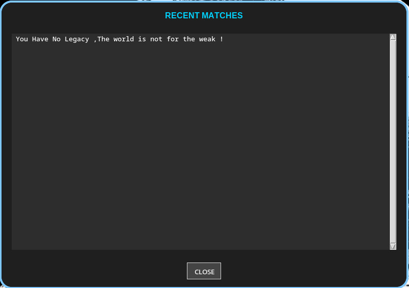
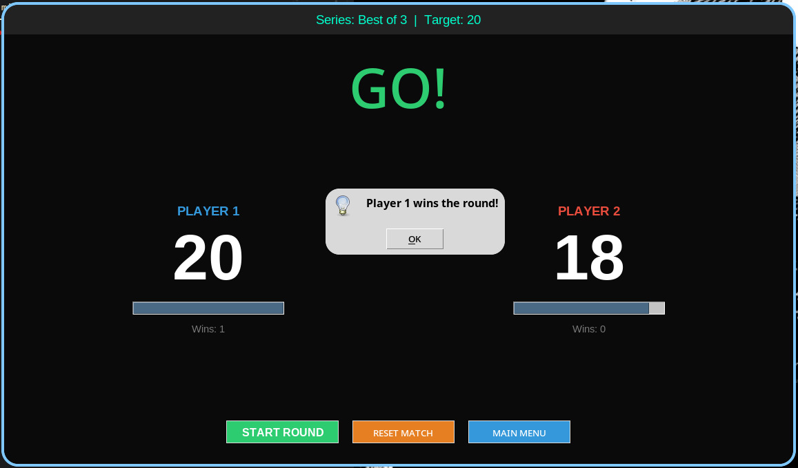
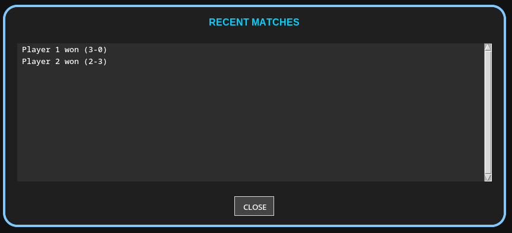

# Mr.Clicky – Fastest Click Wins

## Overview

**Mr.Clicky: Battle Royale** is a simple two-player keyboard game built with **Python and Tkinter**.

Two players compete by pressing their assigned keys as fast as possible.
The first player to reach the target score wins the round. Winning 3 rounds wins the match.

## ScreenShots







## Controls

* **Player 1:** Press `A`
* **Player 2:** Press `L`

## Features

* Countdown before each round
* Random click target for each round
* Best-of match system

## Requirements

* Python 3
* Tkinter

## How to Run

1. Make sure Python 3 is installed.
2. Download the project files.
3. Run the game:


```bash
python game.py
```
